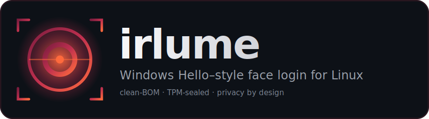

<div align="center">



<br>

**Face-unlock for Linux — login, sudo, lock screen — that works in the dark,
resists photo & screen spoofs, and never stores your face as an image.**

Works with the camera you have: an **IR (Windows Hello) camera** unlocks the full
secure tier, a **regular webcam** gives convenient screen unlock, and a
**fingerprint reader** slots in as a companion factor.

Engineered to meet or beat Windows Hello, on a fully-open, commercially-clean stack.

<br>

[](LICENSE)


[](https://github.com/archledger/irlume/releases)
[](#-faq)

[Install](#-install) · [How it works](#-how-it-works) · [Security](#-your-face-never-leaves-as-an-image) · [Limits](#️-honest-limitations) · [FAQ](#-faq) · [Docs](docs/)

<br>


<sub>From <code>dnf install</code> to a wired face login: guided enrollment, TPM keyring unlock, recovery passphrase, and greeter/lock-screen wiring — all in the TUI.</sub>

</div>

---

## ✨ What you get

|  |  |
|---|---|
| 🌑 **Works in the dark** | Active **infrared** recognition (Windows-Hello cameras) — no ambient light needed. |
| 🔒 **Unlocks everything** | Login greeter, lock screen, and `sudo` (opt-in via `login enable --with-sudo`) — with the password always as fallback (**no lockout, ever**). |
| 🙋 **On-demand, by consent** | The camera fires only when you ask: leave the password field **empty and press Enter**. Typing a password never starts a scan. Wiring is tailored per login manager (GDM · SDDM · Plasma Login · LightDM · greetd · COSMIC). |
| 🗝️ **Opens your keyring** | On IR hardware a face match **TPM-unseals your login password** so the wallet unlocks at login — like Hello. |
| 👁️ **Real liveness** | Algorithmic IR anti-spoof gate + **opt-in passive blink** detection (no prompt, no action). |
| 🧬 **Privacy by design** | Stores **512-D embeddings, never images**; on TPM hardware they're **AES-256-GCM encrypted** under a **TPM-sealed** key (without a TPM: root-only files, and the TUI says so). |
| 🎚️ **Adapts to your hardware** | IR camera → **Secure** tier · RGB-only → **Convenience** (screen-unlock) tier · fingerprint reader → companion factor. All auto-detected. |
| 🩺 **Self-healing** | A live TUI (`irlume tui`) detects & one-key-fixes daemon/PAM/reader/config faults. |
| 📦 **Self-contained** | One package per distro, all models bundled. `git clone` and go. |

## 🆚 Why it's different

How irlume compares to Windows Hello and the Linux face-unlock projects you've
probably met ([Howdy](https://github.com/boltgolt/howdy), [visage](https://github.com/sovren-software/visage)):

| | Windows Hello | Howdy | `visage` | **irlume** |
|---|:---:|:---:|:---:|:---:|
| **Liveness / anti-spoof** | IR only *(bypassable — [CVE-2021-34466](https://msrc.microsoft.com/update-guide/vulnerability/CVE-2021-34466))* | ❌ none — its own README warns a *"well-printed photo of you could be enough"* | ⚠️ passive (landmark-stability; blocks photos, not video) | ✅ algorithmic IR gate **+** opt-in passive blink; self-tested vs [ISO/IEC 30107-3](docs/PAD_SELFTEST.md) |
| **Camera-injection defense** | device-trust *(newer HW)* | ❌ none | ❌ none | ✅ device pinning **+** cross-spectrum RGB↔IR |
| **Template protection** | TPM-bound enclave | ⚠️ unencrypted encodings on disk | AES-256-GCM, key in a 0600 disk file *(not TPM-sealed)* | ✅ AES-256-GCM, **TPM-sealed key** *(survives disk theft)* |
| **Opens your keyring/wallet** | ✅ | ❌ *(keyring stays locked)* | ❌ | ✅ **TPM-unseals** it at login |
| **Stores your face as…** | template | encoding | embedding | **embedding only, never an image** |
| **Model licensing** | proprietary | MIT code · dlib weights | ⚠️ non-commercial weights | ✅ **permissive, bundleable** |
| **Runs on** | Windows | Linux | Linux | **Linux — Fedora · Arch · Debian/Ubuntu** |

## 📦 Install

> **v0.1.2.** Works end-to-end on real hardware across all three families. Not
> yet certified (no iBeta lab pass) — see [Honest limitations](#️-honest-limitations).

**You need:** x86-64 Linux with systemd & PAM — the distros below are
packaged and tested. A **TPM 2.0** is strongly recommended (encrypted templates,
keyring unlock) but not required. Any camera is fine — it just sets your tier:
**IR camera** → secure login · **RGB webcam** → screen unlock · **fingerprint** → companion.

<table>
<tr><th>Fedora</th><th>Ubuntu</th><th>Arch</th><th>Debian</th></tr>
<tr valign="top">
<td>

```sh
# Copr
sudo dnf copr enable \
  archledger/irlume
sudo dnf install irlume
```

</td>
<td>

```sh
# PPA
sudo add-apt-repository \
  ppa:archledger/irlume
sudo apt install irlume
```

</td>
<td>

```sh
# prebuilt from Releases
sudo pacman -U \
  ./irlume-*.pkg.tar.zst
```

</td>
<td>

```sh
# .deb from Releases
sudo apt install \
  ./irlume_*.deb
```

</td>
</tr>
</table>

Fedora and current-LTS Ubuntu update with the system (`dnf upgrade` /
`apt upgrade`). The [PPA](https://launchpad.net/~archledger/+archive/ubuntu/irlume)
carries the **current Ubuntu LTS only**; on an older LTS or a derivative (Mint,
Pop!_OS, Zorin, elementary) use the universal Debian `.deb` from
[Releases](https://github.com/archledger/irlume/releases). `irlume update`
handles every case — it detects how irlume was installed and updates the same way.

Then, once:

```sh
irlume tui                         # enroll your face + configure, guided
sudo irlume login enable --apply   # opt-in: wire the greeter + lock screen
```

`login enable` (and the TUI's `[w]`) wires the **greeter and lock screen** for
your login manager. From then on face is **on-demand**: at the greeter or lock
screen, leave the password empty and press Enter — the camera fires only then.
Face-`sudo` is a separate opt-in — add it with
`sudo irlume login enable --with-sudo --apply`, since granting root by face is a
trade-off worth choosing deliberately (the password always still works).

**Full step-by-step** (both the guided TUI and the individual CLI commands, with
keyring unlock, recovery, and fingerprint): [`docs/SETUP.md`](docs/SETUP.md).
**Something not working — or want to audit every decision?**
[`docs/DEBUGGING.md`](docs/DEBUGGING.md): `irlume logs` puts the whole
face-auth story in one journal view, and `sudo irlume logs debug on` traces
every pipeline stage (scores, liveness cues, thresholds, timings — numbers
only, never frames or embeddings).

No IR-emitter step needed: enrollment probes the IR camera and, if its frames
come back black, auto-discovers and enables the 850 nm emitter itself. Only if
IR stays dark after enrolling, run `sudo irlume ir-setup` manually — it applies
to IR cameras only (on an RGB-only webcam it exits with "not an IR capture
node" without touching anything).

**Safe to try.** Installing the package wires **nothing** into your login —
auth only changes when you run `login enable`, and without `--apply` it's a
dry run that prints the full per-file wiring plan without writing anything. Your password always keeps
working, and one command undoes everything: `sudo irlume login disable --apply`.

`irlume update` checks for a new release the way your distro expects. Prefer to
build from source? See [`packaging/`](packaging/) and [`scripts/install-host.sh`](scripts/install-host.sh).

## 🧠 How it works

Privilege-separated by design. The thin **`pam_irlume.so`** module and **`irlume`**
CLI are *untrusted* clients of the privileged **`irlumed`** daemon — the only thing
that ever touches the camera, IR emitter, models, templates, or TPM. They speak
over a Unix socket authenticated with `SO_PEERCRED`.

```
    ┌───────────────┐   ┌───────────────┐        ╔═══════════════════════════╗
    │ pam_irlume.so │   │  irlume  (CLI │        ║  irlumed   (privileged)   ║
    │  greeter/sudo │   │   + live TUI) │        ║                           ║
    └──────┬────────┘   └───────┬───────┘        ║  camera + IR emitter      ║
           │  SO_PEERCRED       │   Unix socket  ║  YuNet → AuraFace (ONNX)  ║
           └────────────────────┴───────────────▶║  IR liveness · matcher    ║
                                                 ║  TPM seal · templates     ║
                                                 ╚═══════════════════════════╝
```

**Model bill-of-materials** — every weight is permissive or first-party, all
GPLv3-compatible, so the whole thing is bundleable:

| Stage | Model | License |
|---|---|:---:|
| Detection | **YuNet** | MIT |
| Recognition | **AuraFace** *(512-D ArcFace)* | Apache-2.0 |
| Liveness — IR gate | self-built, algorithmic *(no weights)* | — |
| Liveness — passive blink | **MediaPipe FaceMesh** → eye-aspect-ratio *(opt-in)* | Apache-2.0 |
| IR domain adapter | self-trained *(author's own IR captures)* | GPL-3.0 |

More depth: [Architecture](docs/ARCHITECTURE.md) · [Threat model](docs/THREAT_MODEL.md) · [Cross-distro notes](docs/cross-distro/).

## 🔐 Your face never leaves as an image

irlume stores **only 512-D embeddings** (a one-way projection — you can't rebuild
a photo from it), **AES-256-GCM encrypted**, under a key the **TPM seals to your
boot state**. We [audited this live](docs/SECURITY_AT_REST.md):

- 🧑‍💻 A normal user account → `cat`ting the files gives **Permission denied** *(root-only, 0600)*.
- 💽 **Disk-theft test:** copied the encrypted templates **and** the sealed key to a
  *second machine with its own TPM* → **`tpm: integrity check failed`**. The stolen
  data is undecryptable off the original box.

Honest delta vs Hello: Hello isolates templates in a VBS/TPM enclave the kernel
never sees; irlume's daemon is a root process holding decrypted embeddings in RAM
during a match — so **root on the live machine is the trust boundary** (as with
most Linux secrets). Full write-up: [`docs/SECURITY_AT_REST.md`](docs/SECURITY_AT_REST.md).

**Don't take our word for it** — every claim here maps to something you can run
on your own machine: [`docs/VERIFY.md`](docs/VERIFY.md).

## ⚖️ Honest limitations

Trust is built on candor, so — plainly:

- **Passive blink liveness is a deterrent, not a guarantee.** It closes casual and
  typical print/screen attacks, but a *determined life-size glossy print* still
  slips through occasionally, and it **doesn't cover glasses-wearers** (IR lens
  reflections hide the eyelid). Every miss falls **safely to the password**. Beating
  a determined glossy print is the passive-cue ceiling — it needs a trained PAD
  model or true depth hardware. See [ADR-0002](docs/adr/0002-challenge-response-liveness.md)
  and the [PAD self-test results](docs/pad-results/).
- **RGB-only laptops get the Convenience tier:** face unlocks the *screen only* —
  never `sudo`, login, or the keyring (those keep the password). By design.
- **Not lab-certified.** We self-test against ISO/IEC 30107-3; there's no paid iBeta
  pass. Demographic FMR tuning ([FAIRNESS.md](docs/FAIRNESS.md)) is ongoing.

## ❓ FAQ

<details>
<summary><b>Is this "Windows Hello for Linux"?</b></summary>

Yes — that's the bar. irlume brings Windows Hello–style face login to Linux:
face-unlock the login screen, lock screen, `sudo`, and your keyring/wallet,
using the same IR (Windows Hello) camera your laptop already has. And it aims
past Hello where Hello is weak: real anti-spoof liveness, encrypted
TPM-sealed templates, and a fully open stack.
</details>

<details>
<summary><b>How is irlume different from Howdy?</b></summary>

[Howdy](https://github.com/boltgolt/howdy) is the best-known face unlock for
Linux, and it's honest about being a *convenience*: its README says a
well-printed photo could be enough to fool it. irlume is built as an
*authenticator*: an IR liveness gate (self-tested against ISO/IEC 30107-3),
AES-256-GCM-encrypted templates under a TPM-sealed key, camera pinning, and
TPM keyring unlock at login — with tiers, so RGB-only face match is
deliberately limited to screen unlock. See the [comparison](#-why-its-different).
</details>

<details>
<summary><b>Do I need an IR camera?</b></summary>

No. An IR (Windows Hello) camera gets the full **Secure** tier — greeter
login, `sudo`, keyring unlock, works in the dark. A **regular RGB webcam**
gets the Convenience tier: face unlock for the lock screen only. A
**fingerprint reader** works as a companion factor on either. All
auto-detected.
</details>

<details>
<summary><b>Is this AI-generated?</b></summary>

AI-assisted, human-directed — and disclosed throughout the git history: the
large majority of commits carry `Co-Authored-By` trailers naming the AI
assistant (Anthropic's Claude, also visible under this repo's contributors). A human maintainer sets
direction, reviews the changes, and validates every release with clean-slate
installs on real hardware (Fedora, Arch, Ubuntu — IR camera, TPM, fingerprint)
before anything ships. Judge the project by its verifiable artifacts: the
threat model, measured error rates, spoof-test results, and the code itself
are all in the repo, reproducible regardless of what tools wrote them.
</details>

<details>
<summary><b>Can I verify these claims myself?</b></summary>

Yes — that's the point. [`docs/VERIFY.md`](docs/VERIFY.md) maps each claim to a
command you can run: see your own camera's anti-spoof score, confirm the stored
template is encrypted ciphertext (not an image), run the presentation-attack
self-test against your own spoofs, reproduce the real-face FAR on LFW, and build
and run the test suite. Some checks take two minutes, some take real effort, but
every one is runnable.
</details>

<details>
<summary><b>Glasses, beards, outdoors — when should I re-enroll?</b></summary>

One enrollment usually lasts. Add to it when reality changes, the same way
Windows Hello recommends: **wear glasses sometimes?** Enroll a second profile
named `glasses` (TUI Profiles → `[e]`) so both looks match. **Major appearance
change** (shaved beard, new heavy frames)? Add a scan (`[a]`) rather than
starting over. **Recognition flaky in bright sunlight?** Strong ambient IR can
wash out the emitter's illumination — add a scan captured in that environment.
Profiles are per-user and deletable any time.
</details>

<details>
<summary><b>Does it work on Ubuntu / Fedora / Arch, GNOME / KDE, Wayland?</b></summary>

Yes — irlume authenticates through PAM, and tailors the greeter wiring to the
login manager it detects. Validated live on real machines: **Fedora KDE**
end-to-end on IR hardware (Plasma Login Manager greeter, lock screen, `sudo`,
TPM keyring unlock — Wayland), **Ubuntu GNOME** on an RGB+fingerprint laptop
(lock-screen face unlock, fingerprint, correct password-only refusals for
login/sudo), the full login-manager matrix — **GDM** (on-demand on GNOME ≥ 46;
face-first before that), **SDDM**, **LightDM** (gtk and slick greeters, X11),
**greetd** (tuigreet), and **COSMIC's greeter** — and **Arch** for packaging,
install, and the full CLI/daemon stack (that testbed has no camera). Reports
from other hardware are very welcome.
</details>

## 🛠️ Status

**v0.1.2 — working, validated on real hardware across Fedora (full IR Secure tier,
end-to-end), Ubuntu (RGB Convenience tier + fingerprint), and Arch (packaging +
CLI/daemon; camera-less testbed).** Packaged for all three. Actively hardened; interfaces may still shift before 1.0.

## 🤝 Contributing & license

**GPL-3.0-or-later** — fully open, copyleft: modifications stay free, nobody can
lock this down. Contributions welcome under the [DCO](CONTRIBUTING.md) — **no CLA,
no commercial relicensing**. Security reports: see [SECURITY.md](SECURITY.md).

**Questions, setup help, hardware reports** →
[GitHub Discussions](https://github.com/archledger/irlume/discussions). Reports
from laptops with IR cameras (working *or* not) are the most valuable
contribution right now. Bugs → [Issues](https://github.com/archledger/irlume/issues).

> [!NOTE]
> **AI disclosure — assisted, human-directed.** irlume is built by a human
> maintainer working with an AI assistant (Anthropic's Claude), disclosed
> throughout the git history via `Co-Authored-By` trailers — see the log or the
> [contributors](https://github.com/archledger/irlume/graphs/contributors) page.
> Direction, review, and releases are human-driven; every release is validated
> with clean-slate installs on real hardware, and the security claims rest on
> reproducible evaluations in this repo, not on who typed the code.

<div align="center"><sub>Built with Rust · <a href="LICENSE">GPL-3.0-or-later</a> · your face stays yours</sub></div>
