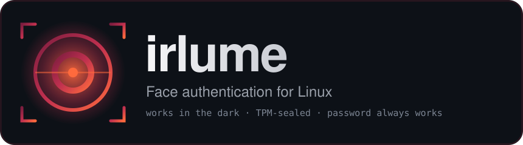

<div align="center">



### Your face or fingerprint unlocks Linux

Login, lock screen, `sudo`, and app prompts like Bitwarden. In the dark, with an
IR camera. Stored as an embedding, never an image. Password always works.

[](LICENSE)


[](https://github.com/archledger/irlume/releases)
[](https://scorecard.dev/viewer/?uri=github.com/archledger/irlume)
[](https://www.bestpractices.dev/projects/13671)
[](docs/FAQ.md)

**[Setup](docs/SETUP.md)** · **[Commands](docs/COMMANDS.md)** · **[Limits](docs/LIMITATIONS.md)** · **[FAQ](docs/FAQ.md)** · **[All docs](docs/)**

<br>


</div>

---

> [!IMPORTANT]
> **A printed photograph of an enrolled face passes the algorithmic IR gate
> alone** (accepted in 69 of 70 measured presentations). The shipped PAD pair
> (ViT RGB + FLIR IR) refuses it, runs default-on, and verifies against signed
> checksums at startup; kill switches: `IRLUME_PAD_VIT=0`, `IRLUME_PAD_IR=0`.
> Read **[Limits](docs/LIMITATIONS.md)** before wiring this
> into anything that matters.

<br>

<div align="center">

|  |  |
|:--|:--|
| 🌑 **Works in the dark** | Infrared recognition, no ambient light needed |
| 🔓 **Unlocks everything** | Login, lock screen, `sudo`, polkit prompts |
| 🗝️ **Opens your wallet** | A face match TPM-unseals your keyring secret |
| 🧬 **No face images** | 512-D embeddings, AES-256-GCM under a TPM-sealed key |
| 🙋 **Only when you ask** | Empty password + Enter. Typing never starts a scan |
| 🩺 **Repairs itself** | A live TUI fixes faults; PAM wiring survives updates |

</div>

<br>

## Install

```sh
curl -fsSL https://raw.githubusercontent.com/archledger/irlume/main/scripts/install.sh | sh
```

<details>
<summary>Or install by hand</summary>

<br>

```sh
sudo dnf copr enable archledger/irlume && sudo dnf install irlume   # Fedora
sudo add-apt-repository ppa:archledger/irlume && sudo apt install irlume   # Ubuntu
yay -S irlume                                                       # Arch
sudo apt install ./irlume_*.deb                                     # Debian 12+, from Releases
```

On NixOS use `nixosModules.irlume` from this flake ([docs/NIXOS.md](docs/NIXOS.md)).
Signed packages for every distro are attached to each
[release](https://github.com/archledger/irlume/releases) as a fallback.
Which lane suits which distro version: [docs/SETUP.md](docs/SETUP.md).

</details>

Then:

```sh
irlume doctor    # what your hardware supports
irlume tui       # guided enrollment and wiring
```

**You need** x86-64 Linux with systemd and PAM. A TPM 2.0 is strongly recommended.
Most cameras work and set your tier (an IR node must offer an 8-bit grey format; see [Platforms](docs/PLATFORMS.md)): **IR** → secure login · **RGB** → screen
unlock · **fingerprint** → companion factor.

## Documentation

| | |
|:--|:--|
| [**Setup**](docs/SETUP.md) | Install and configure, guided or by hand |
| [**Commands**](docs/COMMANDS.md) | Every command and flag |
| [**Limits**](docs/LIMITATIONS.md) | What irlume does not do, and the measurements |
| [**FAQ**](docs/FAQ.md) | Common questions |
| [**Architecture**](docs/ARCHITECTURE.md) | How it works inside |
| [**Security**](docs/SECURITY_AT_REST.md) · [**Threat model**](docs/THREAT_MODEL.md) | What is protected, and from whom |
| [**Verify**](docs/VERIFY.md) | Reproduce every claim on your machine |
| [**Integration**](docs/INTEGRATION.md) · [**Machine API**](docs/MACHINE-API.md) | Drive irlume from your own software |
| [**Debugging**](docs/DEBUGGING.md) | Trace a failing login |
| [**Contributing**](CONTRIBUTING.md) · [**Changelog**](CHANGELOG.md) · [**Credits**](docs/CREDITS.md) | |

## Status

**v0.11.1**, working on real hardware across Fedora, Ubuntu and Arch. Self-tested
against ISO/IEC 30107-3, not lab-certified. Interfaces may shift before 1.0.

Hardware reports from laptops with IR cameras, working or not, are the most
useful contribution right now:
[Discussions](https://github.com/archledger/irlume/discussions) ·
[Issues](https://github.com/archledger/irlume/issues) ·
[Security](SECURITY.md)

If irlume is useful to you and you feel like it, there is a Ko-fi. No
obligation; the project stays free and GPL either way.

[](https://ko-fi.com/O3J824YGEK)

---

<div align="center">

**GPL-3.0-or-later** · no CLA, no commercial relicensing · [credits](docs/CREDITS.md)

<sub>Built with Rust and AI assistance, human-directed ([details](docs/FAQ.md)) ·
Windows Hello is a Microsoft trademark; irlume is independent · your face stays yours</sub>

</div>
