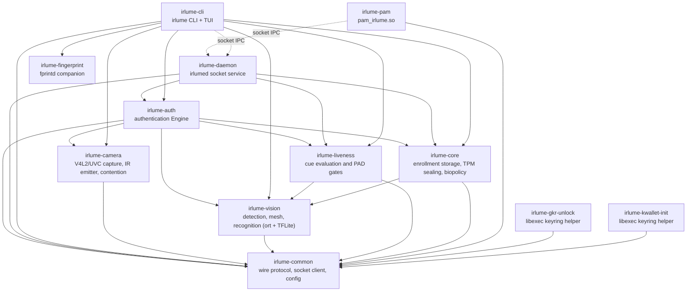

# The irlume crates

Twelve crates. The base layer speaks wire formats and hardware, the
middle layer turns frames into verdicts, and the top layer is the two
binaries and three integration shims users actually run. Solid arrows
read "Cargo-depends on" (every edge verified against cargo metadata);
dotted arrows are runtime socket IPC, not Cargo dependencies.

## One authentication, crate by crate

A greeter or `sudo` reaches `pam_irlume.so` (**irlume-pam**), which sends
one request over the Unix socket whose `Request`/`Response` protocol and
bounded client live in **irlume-common**. That crate also owns shared
config handling and the third-party model catalog; pins enforced by a
model-specific loader live beside that loader, including the production
TFLite mesh pin in **irlume-vision**.
**irlume-daemon** owns the socket, the systemd watchdog contract, and the
per-request authorization (`SO_PEERCRED`), and hands the work to the
Engine in **irlume-auth**. The Engine runs the pipeline: **irlume-camera**
captures the RGB and IR frames (stream negotiation, the IR emitter and its
strobe metadata, the per-camera concurrent-or-sequential contention
verdict), **irlume-vision** runs the models on them (YuNet detection, the face
mesh, whose loader routes a file to the TFLite or ONNX backend by its
bytes and fails plainly rather than retrying the other, and the
recognizer), **irlume-liveness** turns the readings into cue verdicts
(cross-spectrum checks, EAR, the deny-only third-party PAD slot), and
**irlume-core** compares the embedding against the enrolled templates it
stores encrypted, with the template key sealed in the TPM. On a grant the
daemon can unseal the keyring secret, and the two libexec helpers
(**irlume-gkr-unlock**, **irlume-kwallet-init**) deliver it to
gnome-keyring or ksecretd so the wallet opens without a prompt.

**irlume-cli** is the same socket client grown a full CLI and TUI: setup,
enrollment, diagnostics, model management, uninstall. For development and
benchmarks it can also drive the Engine directly, bypassing the daemon
(the solid `cli --> auth` edge; the dotted one is the socket path it
bypasses). **irlume-fingerprint** wraps fprintd so a fingerprint
can stand beside face auth where hardware exists.

## What the graph does and does not promise

- **irlume-auth** is the only crate that composes the pipeline into an
  AUTHENTICATION: a grant decision is born nowhere else. The CLI also
  Cargo-depends on the pipeline crates directly, for its diagnostics,
  benchmarks and model tools, so a change to any pipeline crate must be
  reviewed against the CLI's direct uses too, not only the Engine's.
- **irlume-common** depends on no other irlume crate (except
  **irlume-fingerprint**, which depends on nothing at all), and every
  other crate depends on it: the wire protocol has exactly one home.
- The pipeline crates meet through data, with two deliberate edges:
  **irlume-liveness** and **irlume-core** read **irlume-vision**'s output
  types directly.
- The integration shims (**irlume-pam**, the libexec helpers) stay thin,
  socket client plus their single system interface, so the attack surface
  loaded into PAM stacks and keyring startup is as small as it can be.
  They relate to the daemon only over the socket at runtime; no binary
  links another binary's crate.

Each crate's own source carries the detailed contracts; start at
`irlume-auth/src/lib.rs` for the Engine's assess flow and
`irlume-daemon/src/main.rs` for the request surface.
