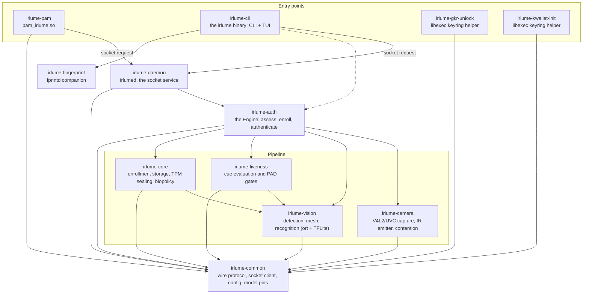

# The irlume crates

Twelve crates, layered so that policy sits above mechanism: the base layer
speaks wire formats and hardware, the middle layer turns frames into
verdicts, and the top layer is the two binaries and three integration
shims users actually run. Arrows read "depends on".

## One authentication, crate by crate

A greeter or `sudo` reaches `pam_irlume.so` (**irlume-pam**), which sends
one request over the Unix socket that **irlume-common** defines (the
`Request`/`Response` protocol, the client with its connect and read
budgets, the config store, and the sha256 pins for every model file).
**irlume-daemon** owns the socket, the systemd watchdog contract, and the
per-request authorization (`SO_PEERCRED`), and hands the work to the
Engine in **irlume-auth**. The Engine runs the pipeline: **irlume-camera**
captures the RGB and IR frames (stream negotiation, the IR emitter and its
strobe metadata, the per-camera concurrent-or-sequential contention
verdict), **irlume-vision** runs the models on them (YuNet detection, the
face mesh on the bundled TFLite runtime with ONNX fallback, the
recognizer), **irlume-liveness** turns the readings into cue verdicts
(cross-spectrum checks, EAR, the deny-only third-party PAD slot), and
**irlume-core** compares the embedding against the enrolled templates it
stores encrypted, with the template key sealed in the TPM. On a grant the
daemon can unseal the keyring secret, and the two libexec helpers
(**irlume-gkr-unlock**, **irlume-kwallet-init**) deliver it to
gnome-keyring or ksecretd so the wallet opens without a prompt.

**irlume-cli** is the same socket client grown a full CLI and TUI: setup,
enrollment, diagnostics, model management, uninstall. For development and
benchmarks it can also drive the Engine directly, bypassing the daemon
(the dashed arrow). **irlume-fingerprint** wraps fprintd so a fingerprint
can stand beside face auth where hardware exists.

## Layering rules the graph enforces

- Only **irlume-auth** composes the pipeline crates; the daemon and CLI
  never reach around it to a camera or a model.
- **irlume-common** depends on no other irlume crate, and everything
  depends on it: the wire protocol and the model pins have exactly one
  home.
- The pipeline crates do not know each other except through data:
  **irlume-camera** produces frames, **irlume-vision** consumes frames and
  produces detections and embeddings, **irlume-liveness** and
  **irlume-core** consume those. The two exceptions are deliberate:
  liveness and core read vision's output types directly.
- The integration shims (**irlume-pam**, the libexec helpers) stay thin:
  socket client plus their single system interface, so the attack surface
  loaded into PAM stacks and keyring startup is as small as it can be.

Each crate's own source carries the detailed contracts; start at
`irlume-auth/src/lib.rs` for the Engine's assess flow and
`irlume-daemon/src/main.rs` for the request surface.
