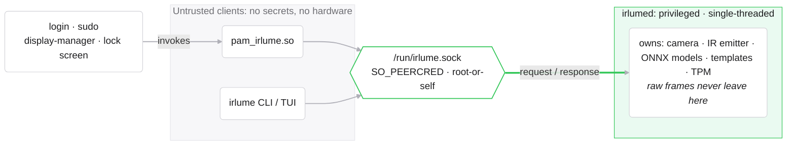
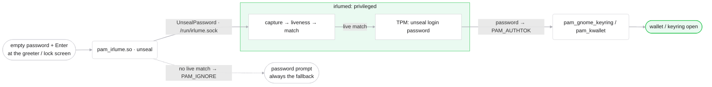

# Architecture

## Privilege separation

The two untrusted clients, `pam_irlume.so` and the `irlume` CLI, reach the
privileged daemon through a single `SO_PEERCRED`-checked Unix socket. Everything
sensitive (the camera, IR emitter, ONNX models, enrolled templates, and the TPM)
lives only inside `irlumed`, which serially handles one request at a time (the camera is one
shared resource; RGB and IR capture within a request run concurrently):

- **Untrusted clients** (`pam_irlume.so`, `irlume` CLI) hold no secrets and touch
  no hardware in production paths; they only send `Request`s and read
  `Response`s. (The `IRLUME_DEV=1` benchmark/capture tools open the camera
  directly by design; they are diagnostics, not auth paths.)
- **`irlumed`** is the sole owner of the camera/IR/models/templates/TPM. This is
  the Linux analogue of Windows Hello ESS's isolated camera→matcher pathway: the
  login/display-manager process tree never sees raw image data.
- **Trust boundary:** `irlumed` reads `SO_PEERCRED` on every connection. Only
  root or the target user may enroll/delete that user's profiles, and the sealed
  login password is released only to a root peer. (We use a raw Unix socket +
  explicit peer check rather than D-Bus policy; that is the concrete hardening
  over the `visage` reference design.)

## Authentication flow

1. Client sends `Authenticate { user, service }` (root or the account owner
   only; the service name drives tier/operation-class gating).
2. `irlumed`: capture RGB (+detect) → capture IR burst → align to ArcFace 112×112
   → AuraFace embed → **liveness gate** (hard) → **matcher** at fixed threshold.
3. On `live && score ≥ threshold`: return `AuthResult { granted: true, .. }`.
   Credential release is a **separate, root-peer-only request**
   (`UnsealPassword`), used by the login stack to open the keyring; a plain
   `Authenticate` never touches the TPM seal.
4. On any failure/timeout: `granted: false` (or an error) → PAM falls through
   to password (mandatory non-biometric fallback, per NIST SP 800-63B-4).

## Face login → keyring unlock

irlume's headline feature is Windows-Hello-style keyring unlock: log in with your
face and your GNOME-keyring / KWallet is already open. When you submit an empty
password field, `pam_irlume.so` (in `unseal` mode) asks the daemon to
`UnsealPassword`. The daemon runs the same pipeline and, **only on a live
match**, TPM-unseals your login password and hands it back; `pam_irlume` sets it
as `PAM_AUTHTOK`, so a downstream `pam_gnome_keyring` / `pam_kwallet` opens the
wallet with the same credential a typed password would have supplied. Anything
short of a live match returns `PAM_IGNORE` and the stack falls through to the
password. (The fingerprint companion reaches the same keyring unlock through a
distinct `UnsealKeyring` request, gated on a root peer in a login context; see
`THREAT_MODEL.md`.)

## Why these choices

See [THREAT_MODEL.md](THREAT_MODEL.md) for the Windows Hello bypass classes
(CVE-2021-34466 IR injection; ESS device-trust) each defense maps to.
